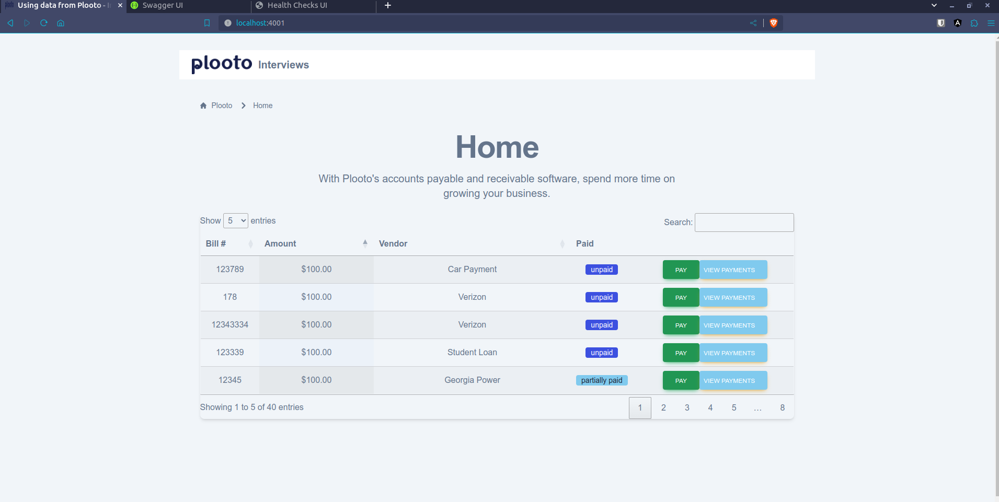
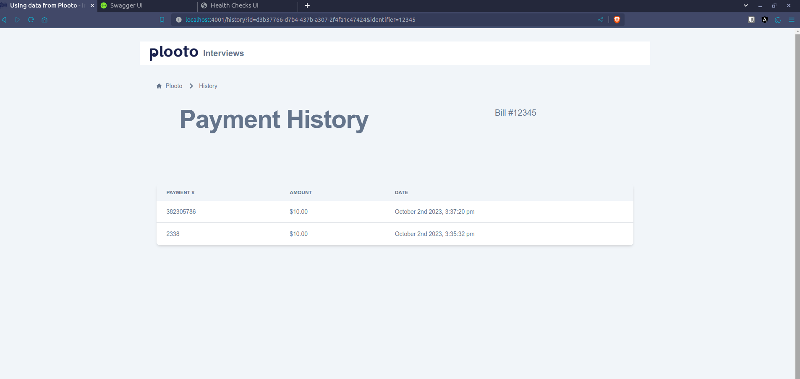
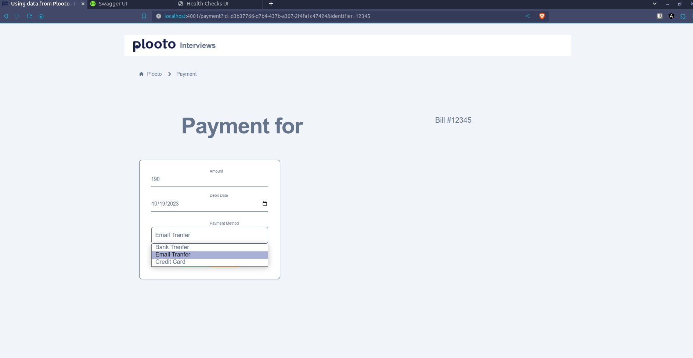
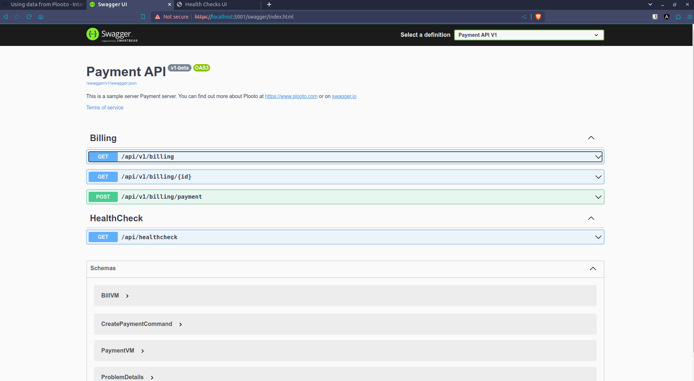
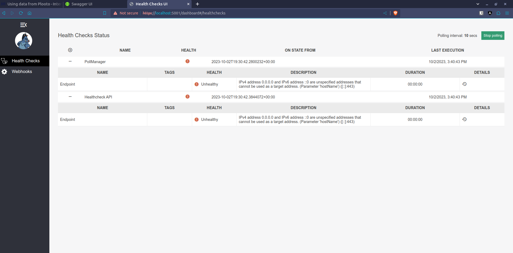
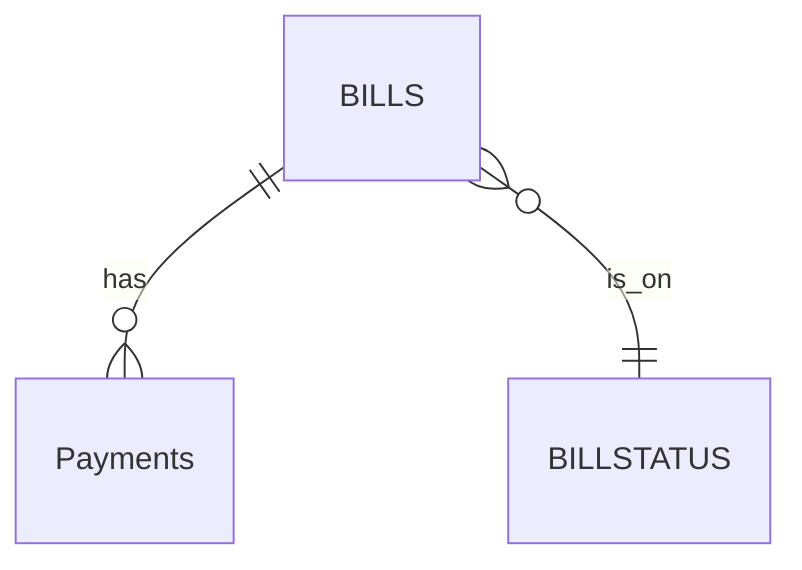
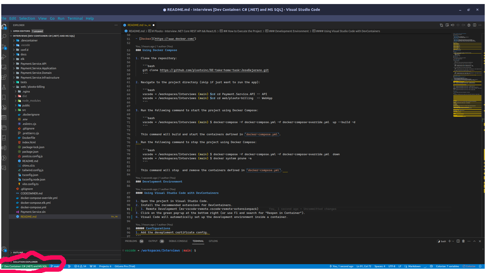
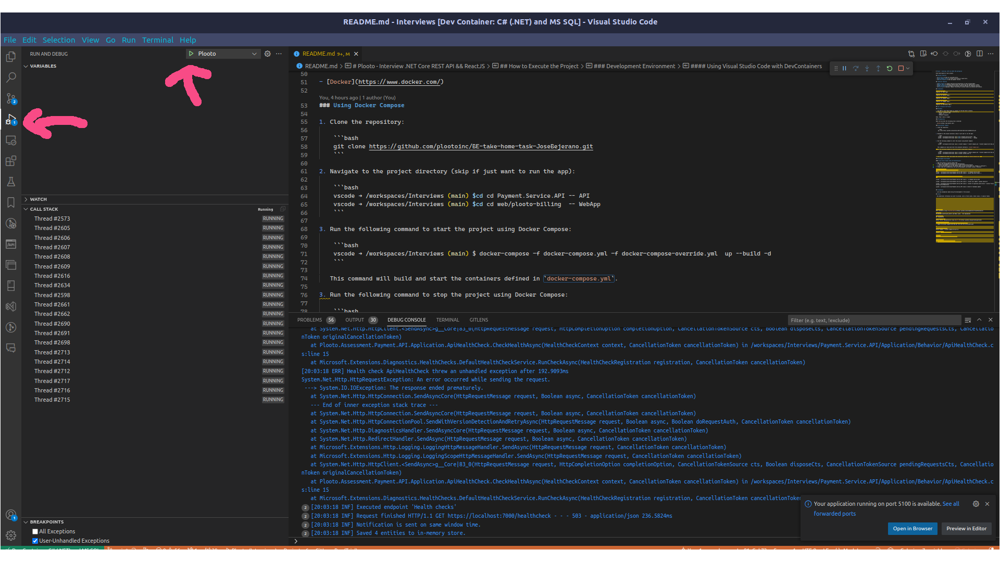
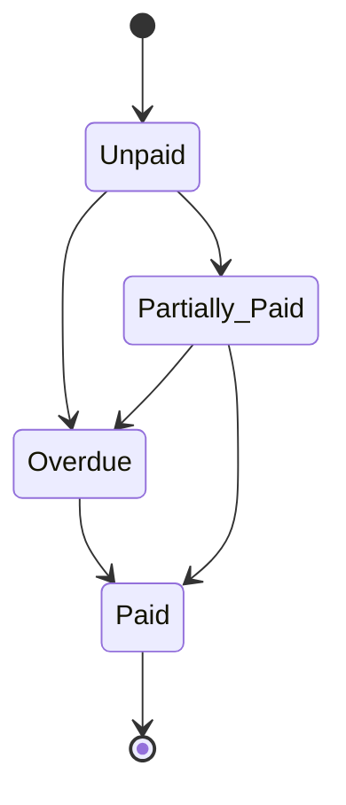

# Interview .NET Core REST API && ReactJS

Brief description of your project.

## Business Features

- **List Bills:** View all available bills.
- **View Payment History:** Access the history of paid bills.
- **Add New Payments:** Add new payment records.

## Technical Features

- **OData Support:** Enable querying and manipulation of data through OData.
- **Health Check:** Implement health checks for monitoring the application's status.
- **CORS Configuration:** Manage Cross-Origin Resource Sharing for enhanced security.
- **Throttling:** Implement request throttling to prevent abuse and optimize performance.
- **Containerization:** Use Docker to containerize the application and the development environment.
- **Logging:** Use Serilog to log application events.
- **API Documentation:** Use Swagger to document the API.
- **Unit Testing:** Use xUnit and Moq to write unit tests(I did not have time to implement it).
- **Integration Testing:** Use xUnit and Moq to write integration tests(I did not have time to implement it).
- **ReactJS && TailwindCSS:** Use ReactJS and TailwindCSS to build the WebApp.
- **Docker Compose:** Use Docker Compose to run the application and its dependencies in containers.
- **SQL Server:** Use SQL Server as the database engine.
- **Entity Framework Core:** Use EF Core as the ORM.
- **Repository Pattern:** Use the Repository Pattern to abstract the data access layer.
- **CQRS:** Use CQRS to separate read and write operations, partially implemented
- **MediatR:** Use MediatR to implement the CQRS pattern, partially implemented
    

## Screenshots


*Caption for Home Page*


*Caption for History Page.*


*Caption for Payment Page.*


*Caption for Swagger Page.*


*Caption for HealthCheck Page.*

## How to Execute the Project


### Prerequisites

Make sure you have the following tools installed:

- [Docker](https://www.docker.com/)

### Using Docker Compose

1. Clone the repository:

    ```bash
    git clone https://github.com/bejerano/Interview.git
    ```

2. Navigate to the project directory (skip if just want to run the app):

    ```bash
    vscode ➜ /workspaces/Interviews (main) $cd cd Payment.Service.API -- API
    vscode ➜ /workspaces/Interviews (main) $cd cd web/plooto-billing  -- WebApp
    ```

3. Run the following command to start the project using Docker Compose:

    ```bash
    vscode ➜ /workspaces/Interviews (main) $ docker-compose -f docker-compose.yml -f docker-compose-override.yml  up --build -d 
    ```

   This command will build and start the containers defined in `docker-compose.yml`.

3. Run the following command to stop the project using Docker Compose:

    ```bash
    vscode ➜ /workspaces/Interviews (main) $ docker-compose -f docker-compose.yml -f docker-compose-override.yml  down
    vscode ➜ /workspaces/Interviews (main) $ docker system prune -a
    ```

   This command will stop  and remove the containers defined in `docker-compose.yml`.   

## Urls

### WebApp
https://localhost:4001
### Swagger
https://localhost:5001/swagger/index.html


### Health Check 
https://localhost:5001/dashboard#/healthchecks

### Database

#### ERD Diagram


1. Use SSMS or Azure Data Studio to connect to the SQL Server instance.
2. Connect to server with this credentials: 
    - Server: localhost,1433
    - Login: sa
    - Password: P@ssw0rd

Go to the folder `Payment.Service.API/data/insertBills` and run the sql script to populated the database:


## Development Environment

#### Using Visual Studio Code with DevContainers

1. Open the project in Visual Studio Code.
2. Install the recommended extensions for DevContainers.
   1. Remote Development (ms-vscode-remote.vscode-remote-extensionpack)


*Caption for Dev Environment.*

3. Click on the green pop-up at the bottom right (or use F1 and search for "Reopen in Container").
4. Visual Code will automatically set up the development environment inside a container (voila, now you have the full app ready for dev).


*Caption for How to debug the app.*

##### Configurations
1. Add the deveploment certificate config. 
```
vscode ➜ /workspaces/Interviews/Payment.Service.API (main) $  cd Payment.Service.API
vscode ➜ /workspaces/Interviews/Payment.Service.API (main) $  dotnet dev-certs https -t
```

2. To add changes to the database use EF Migrations
```

vscode ➜ /workspaces/Interviews/Payment.Service.API (main) $  cd Payment.Service.API

vscode ➜ /workspaces/Interviews/Payment.Service.API (main) $  dotnet tool update --global dotnet-ef

vscode ➜ /workspaces/Interviews/Payment.Service.API (main) $  dotnet ef migrations add Initial --context Plooto.Assessment.Payment.Infrastructure.PaymentContext -o ./Infrastructure/Migrations

vscode ➜ /workspaces/Interviews/Payment.Service.API (main) $ dotnet ef database update
```

## Assumptions

- Bill state flow is: 

## Extras

- Any additional information you want to provide, such as future plans, known issues, or special thanks.

## Validation
Data validation using [FluentValidation](https://github.com/JeremySkinner/FluentValidation)

## Caching
Recommended Cache-Aside pattern and Redis cache. : Not Implemented

## Troubleshooting

#### Deployment in Docker
1. Create the aspnetapp.pfx certificate for local development
2. Update the docker-compose.override.yml file with the certificate path

 

# Start Logging Server (Not Tested)
docker-compose -f docker-compose.elk.yml up

## Open browser
Kibana: http://localhost:5601


